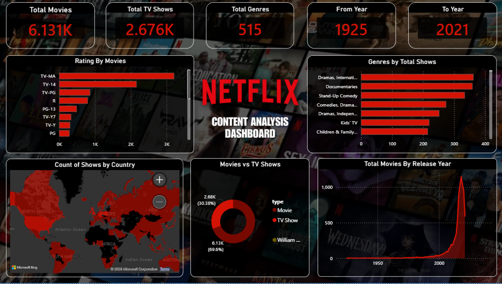

# 🎬 NETFLIX CONTENT ANALYSIS DASHBOARD

### 📊 Advanced Microsoft Power BI Business Intelligence Project

---

## 📌 Project Overview

The **Netflix Content Analysis Dashboard** is an interactive Business Intelligence project developed using **Microsoft Power BI**. This project transforms the publicly available **Netflix Movies & TV Shows** dataset into meaningful business insights through interactive visualizations, KPI-driven analytics, and dynamic reporting.

It enables users to analyze Netflix's global content library by exploring content distribution across countries, genres, ratings, release years, and content types, supporting data-driven decision-making through an intuitive dashboard.

---

## 🖼️ Dashboard Preview

*Figure 1: Netflix Content Analysis Dashboard*
---

# 🎯 Project Objectives

- 🎬 Analyze Netflix Movies and TV Shows.
- 🌍 Explore content distribution by country.
- 🎭 Analyze genre distribution.
- ⭐ Study content ratings.
- 📅 Examine release year trends.
- 🎥 Compare Movies and TV Shows.
- 📊 Build an interactive Power BI dashboard.
- 💡 Generate meaningful business insights.

---

# 📊 Dashboard Features

- 📌 KPI Cards
- 🌍 Content by Country (Map)
- 🎭 Genre Analysis
- ⭐ Rating Analysis
- 🎥 Movies vs TV Shows Comparison
- 📅 Release Year Trend
- 📈 Interactive Dashboard
- 🎛️ Dynamic Filters & Slicers

---

# 💡 Key Insights

- 🎥 Movies represent the majority of Netflix's content library.
- ⭐ **TV-MA** is the most common content rating.
- 🎭 Drama is the most popular genre.
- 🌍 The **United States** contributes the highest number of Netflix titles.
- 📈 Netflix content production increased significantly after **2015**.
- 📊 Interactive visualizations make content exploration faster and easier.

---

# 🛠️ Tools & Technologies Used

- 📊 Microsoft Power BI Desktop
- ⚡ Power Query
- 📐 DAX (Data Analysis Expressions)
- 📑 Microsoft Excel (Initial Dataset Inspection)
- 📂 Kaggle Dataset

---

# 📂 Dataset Information

The dataset used in this project was downloaded from **Kaggle** by searching **"Netflix Movies and TV Shows."**

The dataset was provided in a compressed ZIP format, extracted to obtain the CSV file, and initially reviewed in **Microsoft Excel** before being imported into **Power BI Desktop** for data cleaning, transformation, and visualization.

The dataset contains **8,000+ Netflix Movies and TV Shows** records with information including:

- 🎬 Title
- 📺 Type (Movie / TV Show)
- 🌍 Country
- ⭐ Rating
- 🎭 Genre
- 📅 Release Year
- ⏱️ Duration
- 🎬 Director
- 👥 Cast
- 📝 Description

> **Note:** The dataset was published approximately **five years ago**. Therefore, this dashboard analyzes Netflix content released between **1925 and 2021**, which is why the release-year analysis ends at **2021**.

---

# 📈 Skills Demonstrated

- 📊 Data Visualization
- 📈 Dashboard Design
- 📐 DAX Measures
- ⚡ Data Cleaning
- 🔄 Data Transformation
- 📌 KPI Development
- 🌍 Geographic Analysis
- 📊 Business Intelligence
- 🎛️ Interactive Reporting

---

# 🚀 How to Use

1. Download the **Netflix_Content_Analysis.pbix** file.
2. Open it using **Microsoft Power BI Desktop**.
3. Refresh the dataset if required.
4. Use the interactive slicers and filters.
5. Explore Netflix content trends through the dashboard visuals.

---

# 📁 Repository Contents

- 📊 **Netflix_Content_Analysis.pbix** – Power BI Dashboard
- 📄 **Netflix_Content_Analysis_Report.docx** – Project Report
- 🎤 **Netflix_Content_Analysis_Presentation.pptx** – Presentation Slides
- 🖼️ **Dashboard.png** – Dashboard Preview
- 📂 **Dataset Link** – Google Sheets link to the original dataset
- 📘 **README.md** – Project Documentation

---

# 👨‍💻 Author

**Aakash Nath**

🎓 B.Tech – Information Technology

📧 Email: nathaakash855@gmail.com

💼 LinkedIn: https://linkedin.com/in/aakashnath2003

---

## ⭐ Support

If you found this project useful, please consider *starring ⭐ this repository*. Your support is appreciated!
